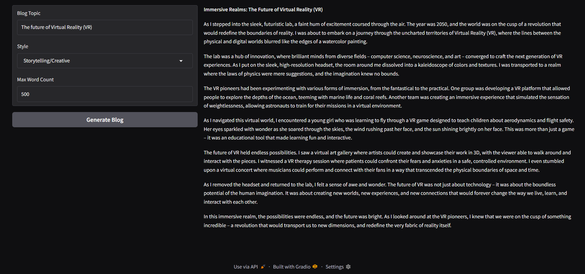
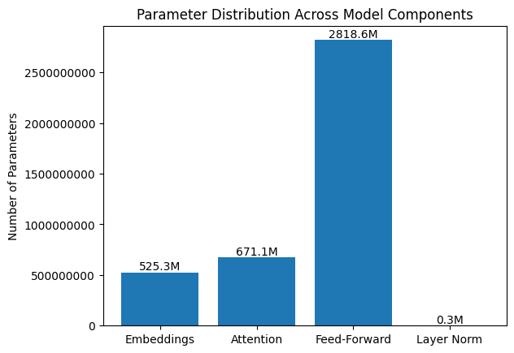
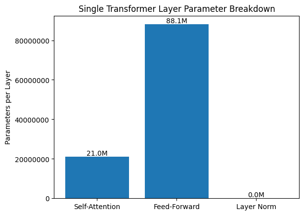
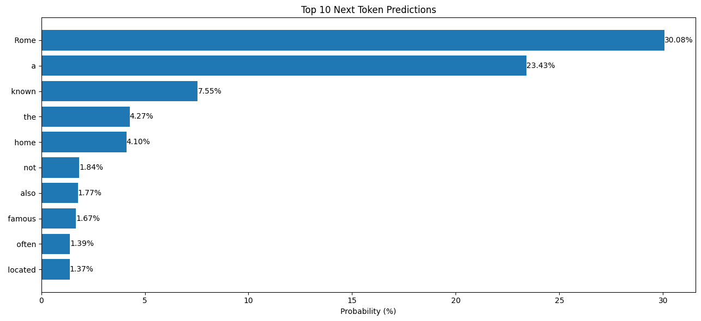

# AI Blog Writer with Multi-Style Generation

**Examining transformer architecture and demonstrating prompt engineering using Llama 3.1 8B**

This project demonstrates how to work with LLMs at a deeper level. I loaded and analyzed the Llama 3.1 transformer model from Meta, explored its architecture using visualizations, implemented basic prompt engineering for different writing styles, and built an interactive interface for multi-style blog generation.

## Demo

### Gradio Interface


### Architecture Visualizations




### Google Colab Notebook Link
https://colab.research.google.com/drive/17v9YEa8vM3_zhJMoaF-rsiT5B7yDtmpB?usp=sharing

## Technical Stack

- **Model**: Llama 3.1 (8B parameters) with 4-bit quantization
- **Framework**: Hugging Face Transformers
- **Quantization**: BitsAndBytes (4-bit NF4)
- **UI**: Gradio
- **Visualization**: Matplotlib
- **Deep Learning**: PyTorch

## Project Overview

This notebook covers two main areas:

**1. Model Architecture Exploration**
- Load Llama 3.1 8B with 4-bit quantization for efficient inference
- Print and analyze model architecture and specifications
- Visualize the distribution of parameters across model components
- Break down a single transformer layer structure
- Visualize next token prediction probabilities

**2. Model Inference**
- Design prompts for 5 distinct writing styles
- Create a generate function for inference
- Build interactive Gradio interface

## Setup Instructions

### Prerequisites

- Python 3.8+
- Google Colab (recommended) or local GPU with 16GB+ VRAM
- HuggingFace token

**Note**: You’ll need to agree to Meta’s terms and conditions and share your contact information to request access to the Llama 3.1 model family. Access is generally granted in a few minutes or so. The model is gated, but the terms are harmless and are just used to ensure it’s not used for any illegal or unethical purposes. You can request access from this link (https://huggingface.co/meta-llama/Llama-3.1-8B-Instruct)

### Installation

The notebook includes installation cells as well. Key dependencies:

```bash
pip install transformers accelerate torch gradio bitsandbytes matplotlib
```
Alternatively, you can skip the top installation cell and use the provided requirements.txt to install all dependencies at once:

```bash
pip install -r requirements.txt
```

### Running the Notebook

1. Open the notebook in Google Colab
2. Connect to a runtime (a free tier T4 GPU should be sufficient if you have time!)
2. Run cells sequentially from top to bottom
3. Model download and quantization takes 10-15 minutes on first run on a T4 GPU
4. Gradio interface launches at the end

## Writing Styles Implemented

The system supports five distinct writing styles:

- **Technical/Professional**
- **Casual/Conversational**
- **Academic/Research**
- **Marketing/Persuasive**
- **Storytelling/Creative**

## Key Features

- 4-bit quantization reduces memory usage by 75% with minimal quality loss
- Model architecture demonstration showing layers and parameters
- Visualizations demonstrating parameter distribution
- Real time token prediction probability visualization
- Adjustable blog output word count
- Prompt templates for all five writing styles
- Interactive Gradio UI

## Customization

### Adjust Generation Parameters

Adjust generation parameters like temperature, do_sample, top_k, top_p, etc.

### Add Streaming in Markdown

Use `TextStreamer` from Transformers to stream the model’s output token by token, allowing real-time updates in the Gradio Markdown component instead of waiting for the full blog to generate.

### Add New Writing Styles

Edit the `STYLE_PROMPTS` dictionary to add custom styles with specific instructions.

### Change Model

Replace `meta-llama/Llama-3.1-8B-Instruct` with other HuggingFace models with similar parameter count.

## License

This project is for educational purposes. Llama 3.1 is released under the Llama 3.1 Community License by Meta Platforms, Inc.